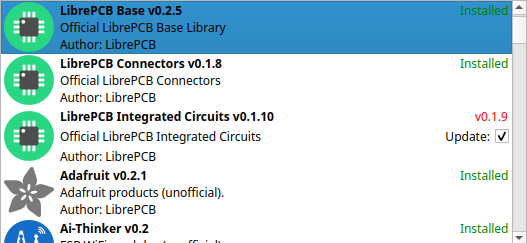
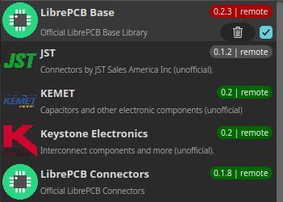

:cpp: C++

Today I am very proud to announce that the LibrePCB project receives
support from the https://nlnet.nl/commonsfund/[NGI0 Commons Fund] to develop
LibrePCB 2.0. This allows us to implement a lot of exciting features and
improvements, see details below.

About the NGI0 Commons Fund
---------------------------

NGI0 Commons is a fund established by https://nlnet.nl[NLnet] with financial
support from the European Commission's https://ngi.eu[Next Generation Internet]
programme, and additional funding by the
https://www.sbfi.admin.ch/sbfi/en/home.html[Swiss State Secretariat for Education, Research and Innovation]
(SERI).

[.text-center]


It's the second time we receive funding through NGI0. LibrePCB 1.0 and 1.1
were major outcomes of
link:[our first grant],
together with our first video tutorials -- important milestones in the
history of LibrePCB.

LibrePCB 2.0 Roadmap
--------------------

The overall goal of the new grant is to release LibrePCB 2.0. Due to the huge
amount of work, I expect it will keep me busy for the next 12 months. But
some of the new features will be made available earlier in a LibrePCB 1.2
release. And of course due to the nature of software development, plans might
need to be adjusted if unexpected issues occur.

New Features
~~~~~~~~~~~~

The following features are planned to be contained in either LibrePCB 1.2 or
2.0:

* Schematic buses
* Images in schematics
* KiCad library import
* Interactive HTML BOM
* Specctra DSN export / SES import
* Advanced board design rules
* And several more...

{cpp} -> Rust
~~~~~~~~~~~~~

In addition, the plan is to start moving away from {cpp} towards the
https://www.rust-lang.org/[Rust] programming language. Generally I like
to work with proven, mature, stable, widely available tooling which was
one reason to choose {cpp} more than 10 years ago when I started with
LibrePCB. {cpp} is simply available on any platform and code written 10
years ago is still working fine today, so we can focus on new features rather
than keeping the code compatible with new toolchain versions. However, more
than a decade later, the situation is a bit different:

* Rust 1.0 was released ~2 years after the LibrePCB project was born
* Today, ~9 years after its 1.0 release, it's a widely used programming
  language, backed by large companies, and probably will last for a long time
* Rust provides not only a compiler, but a whole ecosystem including a
  build system and package management to simplify project administration
* Although Rust is also a low-level, fast programming language, it's much
  safer than {cpp} (memory safety, compile-time checks, ...), leading in
  more reliable applications
* There exist tons of Rust libraries, which are way easier to profit from
  than for {cpp} libraries which are very difficult to share
* The community of Rust is already huge (with lots of smart people) and
  growing fast (probably at cost of {cpp} market share)

Given the advantages of Rust over {cpp}, I think we should really give
it a try and do a first attempt of integrating Rust into the LibrePCB code
base. Of course a complete migration is totally out of scope -- we have to
start with small steps and gather experience with {cpp} interoperability.

Completely New UI
~~~~~~~~~~~~~~~~~

However, our biggest problem at the moment is the user interface. As you might
have noticed, LibrePCB consists of many individual windows and modal dialogs,
packed full of controls. With every new feature, the UI gets more and more
cluttered and thus more complicated (beside the inconvenience of having many
windows opened at the same time). This does not follow our vision of an easy
to use, intuitive UI.

Unfortunately, with our current UI toolkit (QtWidgets) it's almost impossible
to design more dynamic, flexible, responsive UIs. Also it consumes a lot
of time, even simple things in the UI require to write tons of error-prone
code. In addition, the platform-dependent look of Qt often leads to
issues like unreadable text colors or layouting errors. All these things
caused the development of new features to stuck because either I don't know how
it could be implemented with Qt or I'm afraid of writing so much code for it.

As an example, one item in this custom list view requires ~580 lines of code:

[.text-center]

To pave the way for new features (and in general to future-proof LibrePCB),
I was therefore looking for alternatives to QtWidgets. Unfortunately there
aren't many options:

* Stick with QtWidgets, but use custom stylesheets to heavily adjust its look
  (example: https://obsproject.com/[OBS Studio]) -- that even increases the
  effort for UI development and doesn't fix the limitations of QtWidgets.
* Use https://en.wikipedia.org/wiki/QML[QML] -- luckily it's part of Qt so
  it wouldn't be a huge new dependency. Probably it would be usable for
  LibrePCB, but it's error-prone because it's interpreted at runtime, and the licensing situation of QML (or Qt in general) doesn't really go into the
  right direction (getting more and more commercial).
* https://slint.dev/[Slint UI], a pretty young UI framework implemented
  in Rust (but providing a {cpp} API), with a declarative UI language
  which gets interpreted at compile-time and a very powerful live preview.
  Unfortunately it still lacks a lot of basic features and I haven't seen
  any large project yet using Slint, so there's not really a proof that it
  will work for LibrePCB.

Of course there are many other UI frameworks out there, but nothing really
suitable for LibrePCB (no {cpp} API, too bloated, not cross-platform, ...).

At first glance, QML seemed to be the only reasonable way to go, despite its
own issues. However, after playing around with Slint too, I was impressed by
its very neat declarative language and the powerful toolchain -- compared
to QML, it's a real pleasure and very efficient to create UIs. The
interaction with {cpp} is very basic, but seems to cover the most
important use-cases. And even though many features are missing
(e.g. menus, tooltips, drag&drop, ...), lots of things could be implemented
manually.

During my experiments, I tried to quickly create a listview like the one
from the library manager. Compared to the ~580 lines of code of QtWidgets,
a custom list item in Slint takes only ~200 lines of code, and it's even
more responsive (e.g. hover effects):

[.text-center]

Now I'm convinced we should give Slint a real chance, thus it's part of
the LibrePCB 2.0 roadmap.

I hope you are now as excited as I am! 😀
