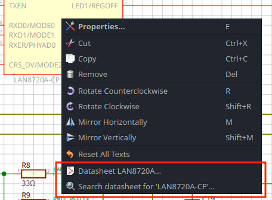

I'm happy to announce that LibrePCB 1.2.0 has been released today! Beside
various general improvements and bugfixes, it contains a lot of new powerful
features to increase productivity. See the highlights & full changelog below.

Highlights
----------

KiCad Library Import (https://github.com/LibrePCB/LibrePCB/pull/1468[#1468])
~~~~~~~~~~~~~~~~~~~~~~~~~~~~~~~~~~~~~~~~~~~~~~~~~~~~~~~~~~~~~~~~~~~~~~~~~~~~

It's not a secret that KiCad is the most popular EDA tool in the open-hardware
community, and therefore many LibrePCB users worked with KiCad before.
To help them getting started with LibrePCB, we implemented an importer for
KiCad libraries so those already created library elements don't need to be
created again with LibrePCB.

In addition, even non-KiCad users could use this feature to import library
elements from publicly available KiCad libraries instead of creating them
manually. Thanks to the large KiCad community, there are a lot of such
libraries! 😀

[.imageblock.rounded-window.window-border]


[WARNING]
====
Due to the complexity of such imports, there are some limitations and the
quality of the output never matches manually created elements. Please check
out the details and usage recommendations
https://github.com/LibrePCB/LibrePCB/pull/1468[here].
====

Datasheet Overlay for Footprints (https://github.com/LibrePCB/LibrePCB/pull/1450[#1450])
~~~~~~~~~~~~~~~~~~~~~~~~~~~~~~~~~~~~~~~~~~~~~~~~~~~~~~~~~~~~~~~~~~~~~~~~~~~~~~~~~~~~~~~~

Drawing footprints can be error-prone -- one wrong X- or Y coordinate of a pad
and the package might not be solderable. To review your footprints more easily,
the footprint editor allows you to set the package drawing from a datasheet
as background image, so you'll immediately see if any pad of polygon is off.

The image can either be directly captured as a screenshot, pasted from the
clipboard, or loaded from a file:

[.imageblock.rounded-window.window-border]


Open Datasheets From Schematic (https://github.com/LibrePCB/LibrePCB/pull/1460[#1460])
~~~~~~~~~~~~~~~~~~~~~~~~~~~~~~~~~~~~~~~~~~~~~~~~~~~~~~~~~~~~~~~~~~~~~~~~~~~~~~~~~~~~~~

[.right.ms-3]

Circuit design means reading datasheets a lot. For most parts more complex than
a resistor or capacitor, you need to read its datasheet or other documentation.

Therefore the library editor now allows you to add datasheet URLs to components
and devices. Those will then be available in the context menu in the schematic
editor for easy access. In addition, parts which have an MPN & manufacturer
specified also offer a _Search datasheet_ menu item which will look
for a datasheet in the Internet.

Whenever possible, datasheets are downloaded and opened with the local PDF
reader. They are cached to keep them available without accessing the Internet
again.

Specctra DSN Export / SES Import (https://github.com/LibrePCB/LibrePCB/pull/1457[#1457])
~~~~~~~~~~~~~~~~~~~~~~~~~~~~~~~~~~~~~~~~~~~~~~~~~~~~~~~~~~~~~~~~~~~~~~~~~~~~~~~~~~~~~~~~

From time to time people ask whether LibrePCB contains an autorouter. Though
there are different opinions about whether autorouters are useful or not, and
even though LibrePCB still doesn't have one built-in, luckily you can now use
an external autorouter like https://freerouting.org/[Freerouting] for LibrePCB
boards!

This is possible by supporting the Specctra DSN/SES exchange format,
which also allows routing a LibrePCB board _manually_ with an external tool
to circumvent the still rudimentary integrated trace routing tools.

[.imageblock.rounded-window.window-border]


Productivity Improvements
~~~~~~~~~~~~~~~~~~~~~~~~~

In addition to the already mentioned features, there have been several more
noteworthy features implemented which increase productivity a lot:

- Mass import symbol pins from datasheets
  (https://github.com/LibrePCB/LibrePCB/pull/1431[#1431])
- Move & align multiple footprint objects at once
  (https://github.com/LibrePCB/LibrePCB/pull/1432[#1432])
- Interactively re-number pads of a footprint
  (https://github.com/LibrePCB/LibrePCB/pull/1433[#1433])
- Copy properties from one footprint object to other objects
  (https://github.com/LibrePCB/LibrePCB/pull/1412[#1412])
- Much faster DRC & plane rebuilding
  (https://github.com/LibrePCB/LibrePCB/pull/1459[#1459])

[TIP]
====
For instructions how to use these new features, please check out the
corresponding links which provide short videos. It's really worth getting
to know those features!
====

Dark Theme on Windows (https://github.com/LibrePCB/LibrePCB/pull/1391[#1391])
~~~~~~~~~~~~~~~~~~~~~~~~~~~~~~~~~~~~~~~~~~~~~~~~~~~~~~~~~~~~~~~~~~~~~~~~~~~~~

Thanks to a contribution from https://github.com/mi4code[mi4code], LibrePCB
on Windows now automatically uses a dark theme if Windows itself is set to
a dark theme. Also for macOS and Linux (which already supported dark theme)
there are some dark theme improvements and fixes.

[.imageblock.window-border]


Important Deployment Changes
~~~~~~~~~~~~~~~~~~~~~~~~~~~~

Please note that for this release we had to make some changes to our deployment:

[WARNING]
====
Windows 7/8/32-bit::
  From this release on, only 64-bit Windows 10 or later are supported.
  Windows 7 & 8 and all 32-bit Windows versions are not supported anymore. See
  link:[LibrePCB 1.1.0 release notes]
  for details. Note that when
  https://librepcb.org/docs/installation/build-from-sources/[building LibrePCB from sources],
  these limitations do not exist (yet).

Windows Installer::
  We migrated to a new Windows installer framework, which now supports
  offline- and unattended installations. If you had LibrePCB installed with
  the old online installer, the new installer should automatically ask you to
  uninstall the old version.

MacOS::
  Our official releases now require macOS 13 or later to run. Older macOS
  versions are still supported if you
  https://librepcb.org/docs/installation/build-from-sources/[build LibrePCB from sources].

CLI::
  Note that the macOS bundle and the Linux AppImage of the LibrePCB application
  now also contain the CLI, thus there's no longer a separate CLI bundle
  provided.
====

---

Changelog
---------

Library Editor:
~~~~~~~~~~~~~~~

- Implement KiCad library import
  (https://github.com/LibrePCB/LibrePCB/pull/1468[#1468])
- Symbol editor: Support mass import of pins through clipboard
  (https://github.com/LibrePCB/LibrePCB/pull/1431[#1431])
- Package editor: Support displaying datasheet image overlay
  (https://github.com/LibrePCB/LibrePCB/pull/1450[#1450])
- Package editor: Add tool to move & align objects
  (https://github.com/LibrePCB/LibrePCB/pull/1432[#1432])
- Package editor: Add tool to interactively re-number pads
  (https://github.com/LibrePCB/LibrePCB/pull/1433[#1433])
- Package editor: Support copying properties to other objects
  (https://github.com/LibrePCB/LibrePCB/pull/1412[#1412])
- Package editor: Support uppercase STEP file suffixes
  (https://github.com/LibrePCB/LibrePCB/pull/1422[#1422])
- Package check: Warn about thin silkscreen lines
  (https://github.com/LibrePCB/LibrePCB/pull/1415[#1415])
- Component editor: Automatically set gate suffixes
  (https://github.com/LibrePCB/LibrePCB/pull/1464[#1464])
- Component editor: Fix conflicting component signal names
  (https://github.com/LibrePCB/LibrePCB/pull/1463[#1463])
- Component check: Warn about missing pin-signal connections
  (https://github.com/LibrePCB/LibrePCB/pull/1466[#1466])
- Symbol/package check: Warn about non-centered symbols/packages
  (https://github.com/LibrePCB/LibrePCB/pull/1467[#1467])
- Eagle import: Fix unreadable log messages with dark theme
  (https://github.com/LibrePCB/LibrePCB/pull/1451[#1451])

Schematic Editor:
~~~~~~~~~~~~~~~~~

- Ask for swapping component names when renaming
  (https://github.com/LibrePCB/LibrePCB/pull/1411[#1411])
- Support adding components with multiline value
  (https://github.com/LibrePCB/LibrePCB/pull/1430[#1430])
- Fix random component name order after paste
  (https://github.com/LibrePCB/LibrePCB/pull/1423[#1423])

Board Editor:
~~~~~~~~~~~~~

- Display component signal names in pads
  (https://github.com/LibrePCB/LibrePCB/pull/1465[#1465])
- Link "no device or package found" message to FAQ
  (https://github.com/LibrePCB/LibrePCB/pull/1421[#1421])
- Fix DRC settings not copied when copying whole board
  (https://github.com/LibrePCB/LibrePCB/commit/7b997c53eaf31be58349bb00fe7dea68e5c29218[7b997c53])
- Fix swapped DRC settings for NPTH/PTH slots
  (https://github.com/LibrePCB/LibrePCB/commit/167214c17975173a521db90d623167edae9f7620[167214c1])

DRC:
~~~~

- Fix false-positive board<->copper clearance errors
  (https://github.com/LibrePCB/LibrePCB/pull/1442[#1442])

Import/Export:
~~~~~~~~~~~~~~

- Implement Specctra DSN export / SES import
  (https://github.com/LibrePCB/LibrePCB/pull/1457[#1457])
- STEP export: Include all PCB outlines, if multiple
  (https://github.com/LibrePCB/LibrePCB/pull/1392[#1392])
- STEP export: Fix possibly wrong placement of devices
  (https://github.com/LibrePCB/LibrePCB/pull/1401[#1401])

Miscellaneous:
~~~~~~~~~~~~~~

- Implement automatic dark theme for Windows
  (https://github.com/LibrePCB/LibrePCB/pull/1391[#1391])
- Support specifying & opening datasheets in editors
  (https://github.com/LibrePCB/LibrePCB/pull/1460[#1460])
- Refactor & speed up plane rebuilds & DRC with multithreading
  (https://github.com/LibrePCB/LibrePCB/pull/1459[#1459])
- Delete old temporary files at application startup
  (https://github.com/LibrePCB/LibrePCB/pull/1452[#1452])
- Qt6: Fix temporarily closing windows when opening 3D viewer
  (https://github.com/LibrePCB/LibrePCB/pull/1381[#1381])
- Windows: Fix encoding issues in auto-detected full user name
  (https://github.com/LibrePCB/LibrePCB/pull/1382[#1382])
- Fix possibly wrong language of theme color names
  (https://github.com/LibrePCB/LibrePCB/pull/1389[#1389])
- Fix colors of BOM/PnP table rows with dark theme
  (https://github.com/LibrePCB/LibrePCB/pull/1407[#1407])
- Fix zero-length traces/lines not being rendered
  (https://github.com/LibrePCB/LibrePCB/pull/1441[#1441])
- Fix deserialization of pressfit pads
  (https://github.com/LibrePCB/LibrePCB/pull/1444[#1444])
- Fix OpenGL 3D viewers for Qt > 6.6
  (https://github.com/LibrePCB/LibrePCB/pull/1469[#1469])
- Fix possibly laggy UI when worker threads are running
  (https://github.com/LibrePCB/LibrePCB/pull/1408[#1408])
- Replace pick&place icon from Icons8
  (https://github.com/LibrePCB/LibrePCB/pull/1395[#1395])

Building/Packaging/Deployment:
~~~~~~~~~~~~~~~~~~~~~~~~~~~~~~

- MacOS: Ship the CLI in the same bundle as the GUI app
  (https://github.com/LibrePCB/LibrePCB/pull/1378[#1378])
- MacOS: Build binaries with macOS 13
  (https://github.com/LibrePCB/LibrePCB/pull/1438[#1438])
- Linux: Ship the CLI in the same AppImage as the GUI app
  (https://github.com/LibrePCB/LibrePCB/pull/1380[#1380])
- Use Qt6 by default & remove Qt5 CI jobs
  (https://github.com/LibrePCB/LibrePCB/pull/1377[#1377])
- Drop support for Qt < 5.12 and CMake < 3.16
  (https://github.com/LibrePCB/LibrePCB/pull/1385[#1385])
- Snap/Flatpak: Fix opening keyboard shortcuts PDF
  (https://github.com/LibrePCB/LibrePCB/pull/1383[#1383])
- Fix compile error in `libs/optional` with Clang 19.x
  (https://github.com/LibrePCB/LibrePCB/pull/1456[#1456])
- Windows: Fix compile error caused by OpenGL headers
  (https://github.com/LibrePCB/LibrePCB/commit/058ccaf806f90cb8ea59334e6e97f679dc581dee[058ccaf8])
- Fix license identifier in AppStream Metainfo XML
  (https://github.com/LibrePCB/LibrePCB/pull/1384[#1384])
- Update REUSE copyright metadata
  (https://github.com/LibrePCB/LibrePCB/pull/1404[#1404])

---

Credits
-------

[.right.ms-3]
image:nlnet-ngi0.png[link="https://nlnet.nl/project/LibrePCB/",width=130]

This release was part of the
link:[NGI0 Commons grant]
we receive from link:https://nlnet.nl[NLnet], which was a huge help for us
to get this work done. We are very thankful for their support.

Also a big thank you to the community helping us with translations, pull
requests, donations and other contributions! icon:tada[]

---

Download
--------

The release can be downloaded for all major operating systems from our download
page:

https://librepcb.org/download/
~~~~~~~~~~~~~~~~~~~~~~~~~~~~~~

If you like LibrePCB, please consider making a small
link:[donation] to support the
ongoing development. +
Thank you! icon:heart[]
