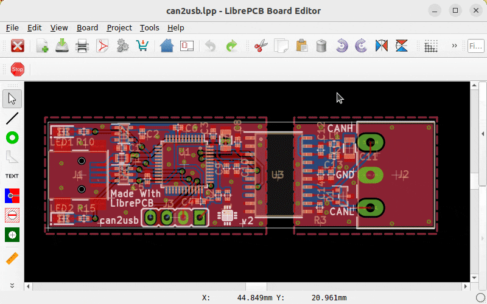
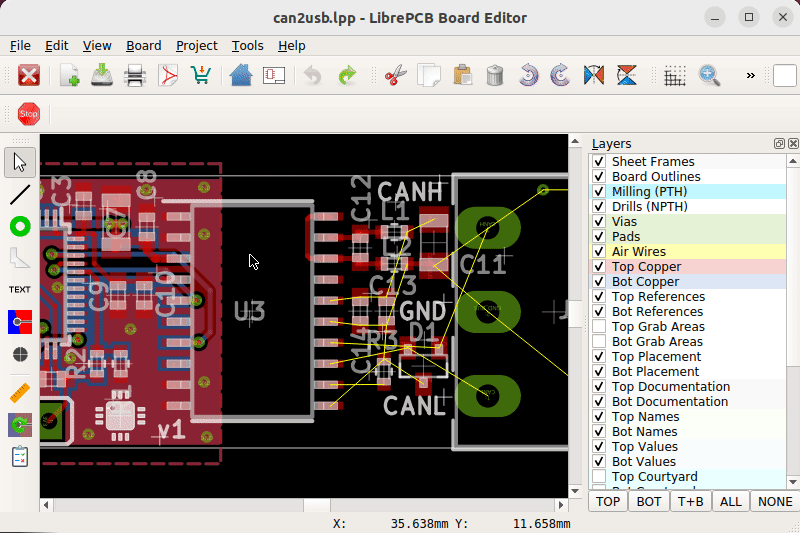
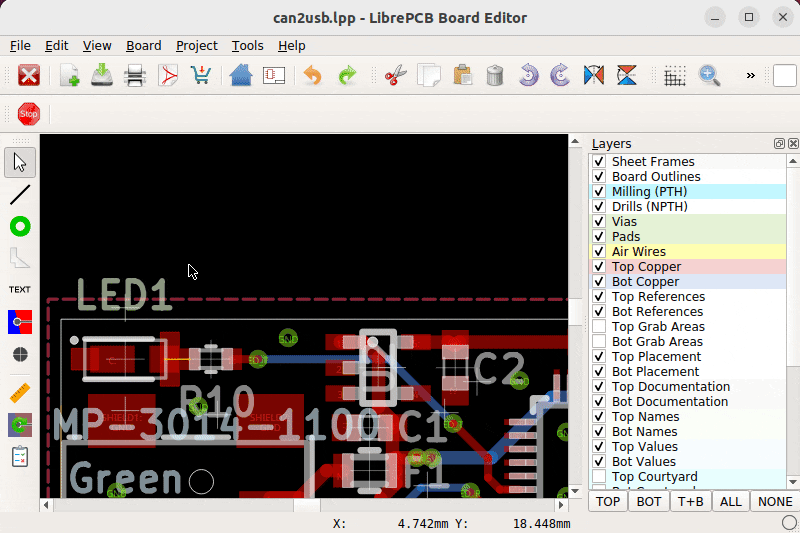

== icon:list[] Feature Overview

The board editor provides the following features:

* Easy-to-use, intuitive interface (including keyboard navigation)
* Multi-layer PCB (more than you'll need; supporting blind- & buried vias)
* Design rule check (DRC)
* Live 3D viewer
* Import formats: DXF, EAGLE (project import)
* Export formats: See
  link:[output jobs]

== icon:cube[] 3D Preview

The integrated 3D viewer shows you an accurate live preview how your PCB
will look after production, including the assembled parts where 3D models
are available. Our official libraries already contain 3D models for many
standard packages, so those just work out of the box without any configuration.

[.rounded-window.window-border]

== icon:code-branch[] Board Branching

PCB layout is an iterative process and sometimes requires to try out something
before discarding it to try another way. LibrePCB directly supports this
workflow -- just duplicate the board, try different strategies and remove the
unneeded boards afterwards. All boards will automatically be in sync with
the schematics during the whole time.

[.rounded-window.window-border]

== icon:shuffle[] Footprint/Device Switching

If a package is available with multiple footprints, you can switch between them
very easily without needing to touch the schematic at all. It's even possible
to switch to a completely different device.

[.rounded-window.window-border]

