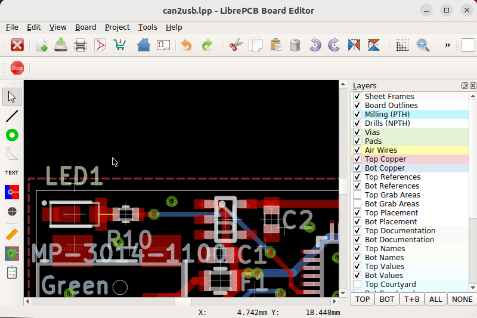

== icon:list[] Feature Overview

The board editor provides the following features:

* Easy-to-use, intuitive interface (including keyboard navigation)
* Multi-layer PCB (more than you'll need)
* Design rule check (DRC)
* Import formats: DXF
* Export formats: PDF, SVG, pixmap, BOM, pick&place, Gerber/Excellon

== icon:code-branch[] Board Branching

PCB layout is an iterative process and sometimes requires to try out something
before discarding it to try another way. LibrePCB directly supports this
workflow -- just duplicate the board, try different strategies and remove the
unneeded boards afterwards. All boards will automatically be in sync with
the schematics during the whole time.

[.rounded-window.window-border]

== icon:shuffle[] Footprint/Device Switching

If a package is available with multiple footprints, you can switch between them
very easily without needing to touch the schematic at all. It's even possible
to switch to a completely different device.

[.rounded-window.window-border]

== icon:file-export[] Feature-Rich Export

The highly configurable export with live preview allows to generate
nice looking assembly plans and other documentation. Beside printing and
copying to clipboard, there are many output formats supported -- PDF, SVG,
PNG and more. PDFs will contain selectable/searchable texts (not just
graphics).

[.rounded-window.window-border]
image::pdf-export.gif[PDF export]
