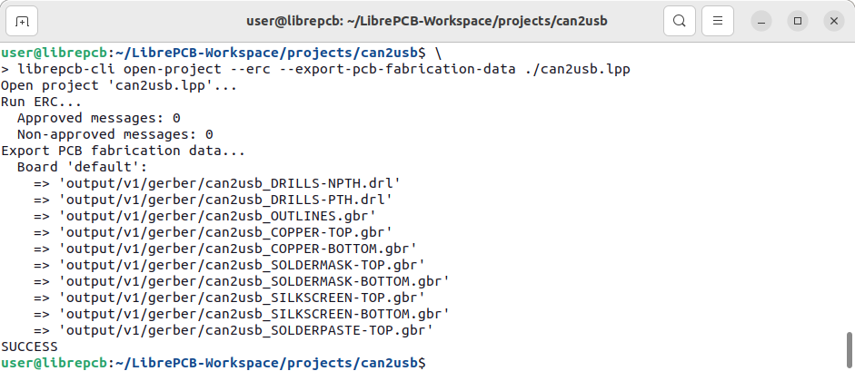

In the software development world,
https://en.wikipedia.org/wiki/Continuous_integration[continuous integration (CI)]
is a widely used strategy to enforce a high level of quality on products.
Whenever changes are made on the source code, many automated checks, tests
and other tasks are executed on servers to ensure everything still works as
expected.

In the EDA world, we are also familiar with checks and other recurring tasks:
Running the ERC & DRC, exporting Gerber files, bundling them in a ZIP file
for the PCB manufacturer etc. Unfortunately this goes wrong regularly, for
example by simply forgetting to run the DRC before exporting Gerber files.

We think continuous integration also makes sense for PCB projects to
avoid such mistakes. Therefore LibrePCB comes with a simple command-line
application `librepcb-cli` which allows to run the most common tasks in
a headless, automated way. For more details, please check out the
https://librepcb.org/docs/cli/[documentation].

[.rounded-window.window-border]

[TIP]
====
All our official libraries have set up
https://github.com/features/actions[GitHub Actions CI] with `librepcb-cli`
running from its
https://hub.docker.com/r/librepcb/librepcb-cli[official Docker image].
It's just
https://github.com/LibrePCB-Libraries/LibrePCB_Base.lplib/blob/5c5277f8b0571725155ef38a16f73a6b99574d40/.github/workflows/main.yml[a few lines of code]
to get it running!
====

[NOTE]
====
Currently the CLI provides only very basic functionality, but we will add more
features from time to time. Stay tuned!
====
