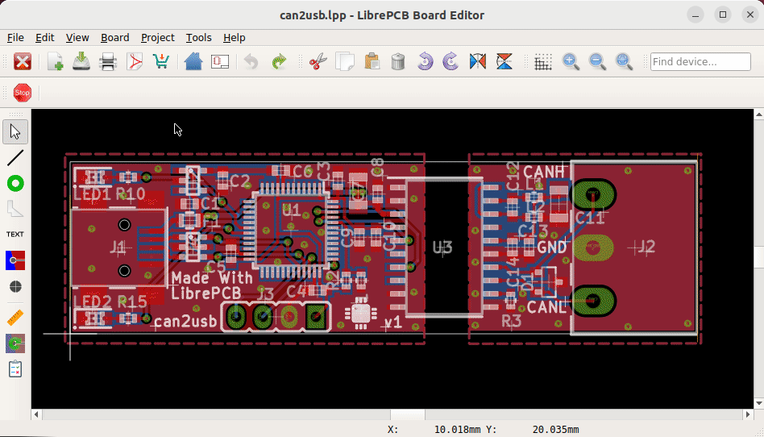

Sometimes, ordering PCBs is cumbersome -- there can many things go wrong
from generating the Gerber files until an operator produces the PCB. Many
manual, error-prone steps are involved in this procedure.

LibrePCB provides a very simple, alternative way to order PCB:
https://fab.librepcb.org[LibrePCB Fab]. It is not only
less error-prone, it is even much faster than the traditional way since
there is no manual file handling involved.

[.rounded-window.window-border]

With this service, your next order is just a few clicks away! Check out
https://librepcb.org/docs/quickstart/create-project/order/#librepcb-fab[the documentation] for details.

[NOTE]
====
Of course using this service is optional. LibrePCB allows to export all
production data files (Gerber, Excellon, BOM, Pick&Place) as usual.
====
