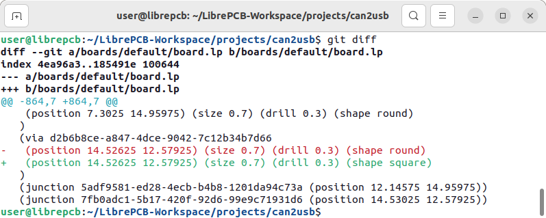

== icon:book-open-reader[] Human-Readable

LibrePCB stores all libraries and projects in *human-readable text files*.
This has many advantages:

* When using a version control system, you'll see and understand the changes.
* Within some limits, it even allows to use _branching_ and _merging_.
* In case of an invalid file (e.g. due to wrong merge conflict resolution),
  issues can be fixed by hand in a simple text editor.
* It allows to automatically generate, modify or extract information from
  files with custom tools (e.g. scripts).

== icon:magnifying-glass-plus[] Minimal Diffs

But using a random text-based file format is not enough. The applicability
of version control systems is heavily improved by the following things:

* User-related settings (e.g. canvas position, layer colors, ...) are strictly
  separated from functional settings, to allow ignoring them by the VCS.
* The file format is canonical, i.e. for any imaginable data set there exists
  only one exact representation.
* Line breaks are controlled to get a good balance between _length_ of lines
  and _number_ of lines.
* Non-informative content is minimized (e.g. syntax elements).

To fulfil all these requirements, LibrePCB uses a file format based on
https://en.wikipedia.org/wiki/S-expression[S-Expressions]. Since this format
only specifies the very basic syntax, we have the full control over the used
data types, formatting etc. If you're interested in an example, check out
https://github.com/LibrePCB-Libraries/LibrePCB_Base.lplib/blob/662a148d46ac785a84fd68b98e311322771a0bc2/sym/75372c18-3ba4-42e8-b3b2-2eb5039d441e/symbol.lp[our official resistor symbol].

[.rounded-window.window-border]

== icon:file-zipper[] Self-Contained

A LibrePCB project is 100% self-contained -- enforced by the tool, there's
no way to break this rule. In particular, a project contains:

* All library symbols, footprints, components and devices it depends on
* All stroke fonts used within boards
* All relevant settings

Therefore you can open a LibrePCB project on any computer and it will always
look exactly the same -- no matter on which operating system, no matter which
libraries are installed and no matter how you configured LibrePCB.

[NOTE]
====
Schematic fonts are bundled with LibrePCB and are the same on all platforms
(i.e. schematics _don't_ use system fonts) to even make schematics independent
of the environment. Thus it's not required to also embed these fonts within
projects (these are quite large binary blobs).
====

== icon:lock[] Strictly Stable & Versioned

Already had the issue that a PCB project was broken after downgrading to an
older tool version? Or already had troubles with several people working on the
same project are constantly reverting each others modifications because they
didn't use exactly the same tool version?

Things like that cannot happen with LibrePCB. The file format of libraries
and projects is completely freezed between major releases. For example
LibrePCB v1.999 still uses exactly the same file format as v1.0, so your
team can work with _any_ v1.x release on the same project without troubles.

In addition, downgrading to an older major version is explicitly rejected by
the tool since this is usually a destructive, dangerous operation.

[TIP]
====
For more details about the file format versioning, check out the
https://developers.librepcb.org/d1/d69/doc_versioning.html[specifications].
====
