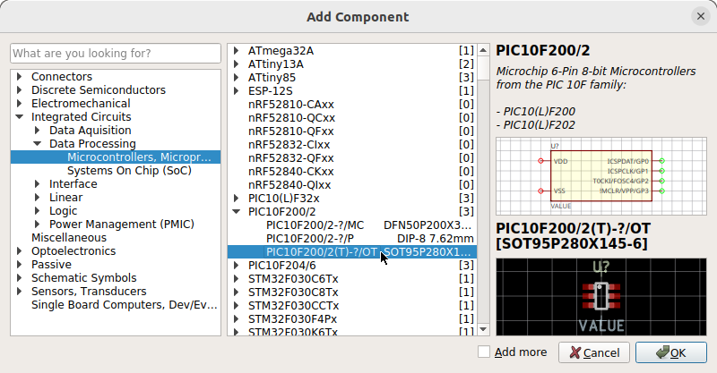

[TIP]
====
**_A sane library concept is the foundation of a sane EDA package._**
====

LibrePCB follows this principle from its very first day on. And that's
the main reason why LibrePCB is different compared to other EDA packages.

== icon:link[] Stable Cross-References

In LibrePCB, names signify nothing. Library names, component names, pad names,
net names -- all irrelevant for the tool, they're just for humans. This allows
you to rename things at any time without breaking any libraries or projects.

The tool uses stable, unique identifiers for all cross-references to make
them reliable. References even work across libraries, so feel free to move
components from one library into another without any consequences.

== icon:layer-group[] Multi-Footprint Packages

Most EDA tools do not distinguish between _packages_ and _footprints_ -- they
only know footprints, which doesn't reflect the real world. LibrePCB's library
system respects that there may exist multiple footprints for the same package.
Check out this video to see how it works:



== icon:section[] Norm-Aware Symbols

A similar problem exists with symbols. American symbols (IEEE norm) and
European symbols (IEC norm) look different, but represent exactly the same
component. The same applies to different representations for logic gate
symbols etc. This video explains how LibrePCB takes this into account:



== icon:shuffle[] Flexible Pin-to-Pad Assignments

Some EDA packages extract pin-to-pad assignements (_pinouts_) just by matching
pin- and pad-names (e.g. connecting symbol pin `1` to footprint pad `1`). But
this doesn't reflect the real world and is thus very error-prone. There's not
even a clean way to create devices with an unusual pinout (e.g. SOT-23
transistors with reversed pinout).

LibrePCB solves this problem with an abstraction for _component signals_.
One pinout exists between symbol pins and component signals, and another
pinout exists between the component signals and the pads of each device
(possibly different for specific devices).

These pinouts are all stored within the libraries. *When adding a device to
your board, you don't need to worry about pinouts at all.*

== icon:tags[] Categorization

Finding components by name or contained library is fine when you know exactly
which component you're looking for. But sometimes that's not the case --
sometimes you just want to browse through the components to discover what's
available. Or maybe you just forgot the term "Zener" but you know you're
looking for a diode.

That's easy with LibrePCB since everything is organized into a multilevel
category tree. Just click through the tree to see what components are there.

[.rounded-window.window-border]

== icon:box[] One Bundle for Everything

LibrePCB does not use different library formats for different kinds of
library elements. Instead, it is a generic bundle which can contain elements
of any kind -- for example symbols, footprints and components.

Thanks to this future-proof concept, libraries can easily be extended with
new kinds of library elements (e.g. 3D models or SPICE models) whenever needed.

== icon:book[] Specifications

Interested in more details about the library structure? Check out its
https://developers.librepcb.org/df/d4f/doc_library.html[specifications]!
