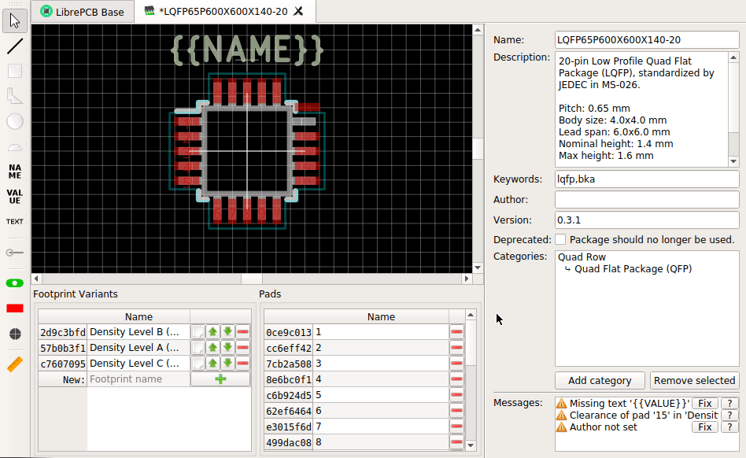

== icon:list[] Feature Overview

The library editor provides the following features:

* Easy-to-use, intuitive interface (including keyboard navigation)
* Live rule check to warn about common mistakes
* Import formats: DXF, EAGLE
* Export formats: PDF, SVG, pixmap

== icon:clipboard-check[] Rule Check

A live rule check warns you about common mistakes while drawing symbols,
footprints or when creating other library elements. This helps to save
time since mistakes can be fixed before they appear in a project.

[.window-border]

