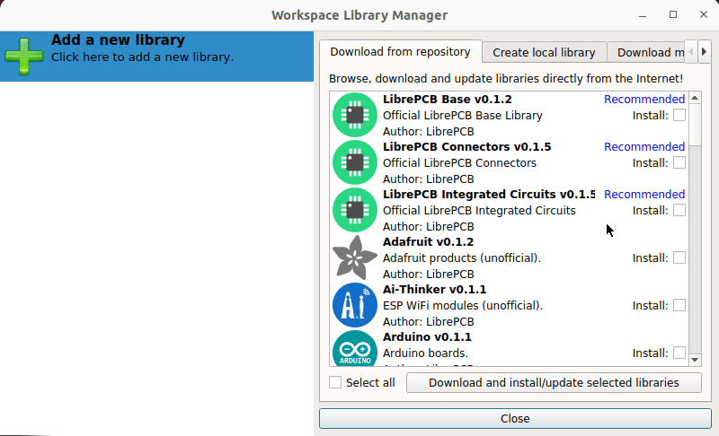

== icon:rocket[] Freedom

The LibrePCB application itself does not have any libraries bundled. Instead,
libraries are installed and updated independent of the application. This
gives you the full control over the library management -- you can install
either our official libraries, use your own libraries, or a mix of both.

== icon:bars-progress[] Built-In Library Manager

If you like to use our official libraries, the integrated library manager
allows you to install and update them in a few seconds. No manual file
download is needed.

[.rounded-window.window-border]

== icon:code-branch[] Compatible with VCS

Since a library is just a directory containing some files, you can easily put
every library under version control with the version control system (VCS) of
your choice. A typical setup is to manage the official LibrePCB libraries
with the integrated library manager, while using e.g. Git to manage
private libraries.
