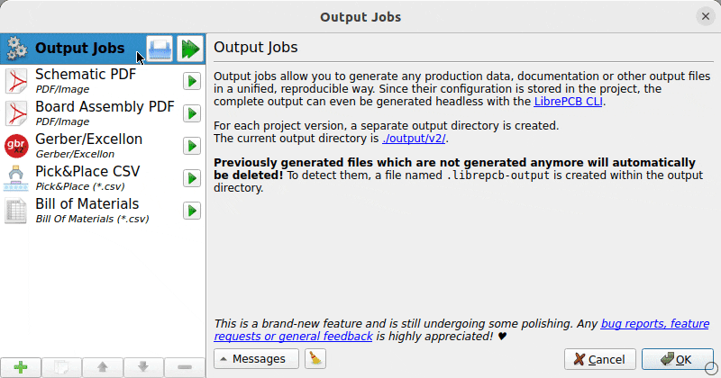

LibrePCB allows you to export production data like a professional, customized
to your workflow and preferences. Just set up the so-called _Output Jobs_ once,
and run them as often as you need with a single click.

*Highlights:*

* Support for multi-configuration jobs, e.g. individual BOMs for each assembly
  variant
* Built-in bundling of output files in ZIP archives
* Run jobs individually or all at once
* Configuration is stored in the project, under version control if desired
* Obsolete/outdated files in output folder are reported & deletable with a
  single click
* Jobs can be run headless through the
  link:[command-line interface]

[.rounded-window.window-border]

[TIP]
====
*Supported output formats:*

* Documentation: PDF/SVG/pixmaps of schematics and/or boards
* PCB production data: Gerber/Excellon
* Pick&Place: CSV, Gerber X3
* Netlist: IPC D-356A
* BOM: CSV
* 3D model: STEP
* And more...
====
