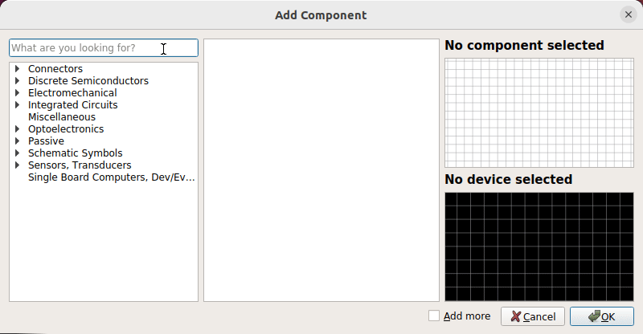
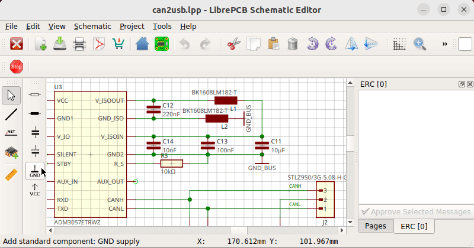

== icon:list[] Feature Overview

The schematic editor provides the following features:

* Easy-to-use, intuitive interface (including keyboard navigation)
* Instant synchronization with board editor (automatic forward annotation)
* Multi-page schematics
* Live electrical rule check (ERC)
* Export formats: PDF, SVG, pixmap, CSV BOM

== icon:search[] Fast, Global Part Search

The part search function lets you find parts in all installed libraries very
quickly:

[.rounded-window.window-border]

== icon:forward[] Lazy Device Assignment

LibrePCB allows you to first draw a rough schematic without worrying about
footprints or part numbers yet. The exact parts can optionally be assigned
later when starting with the layout. This can save a lot of time during the
iterative process in the design phase.

[.rounded-window.window-border]

