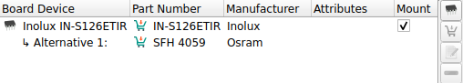
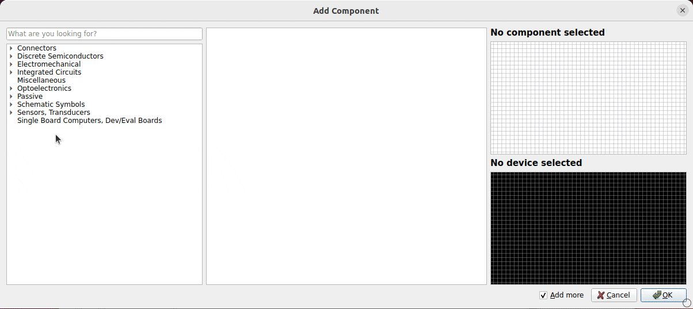

== icon:list[] Feature Overview

The schematic editor provides the following features:

* Easy-to-use, intuitive interface (including keyboard navigation)
* Instant synchronization with board editor (automatic forward annotation)
* Multi-page schematics (flat hierarchy)
* Comprehensive support for assembly data management (e.g. MPNs)
* Live information about parts (lifecycle status, availability, pricing, ...)
* Live electrical rule check (ERC)
* Import formats: EAGLE (project import)
* Export formats: See
  link:[output jobs]

== icon:forward[] MPN Management & Assembly Variants

In LibrePCB, part numbers (MPNs) are not just custom, dumb attributes or
labels in the schematic since this is not sufficient for many real-world
scenarios. Instead, the following features are built-in to cover such
scenarios:

* MPNs can be stored in the part libraries for easy reuse
* Support specifying multiple assembly variants for a project
* Support specifying alternative (second-source) MPNs for parts

[.window-border]

== icon:chart-line[] Live Part Information

Thanks to the integrated live part information you are always aware of the
lifecycle status and stock availability of the parts used in your project.
Ending up with obsolete or out-of-stock parts thus won't happen with LibrePCB:

[.rounded-window.window-border]

== icon:search[] Fast, Global Part Search

The part search function lets you find parts in all installed libraries very
quickly:

[.rounded-window.window-border]
image::search-device.gif[Search device]

== icon:forward[] Lazy Device Assignment

LibrePCB allows you to first draw a rough schematic without worrying about
footprints or part numbers yet. The exact parts can optionally be assigned
later when starting with the layout. This can save a lot of time during the
iterative process in the design phase.

[.rounded-window.window-border]
image::add-component.gif[Add component]
