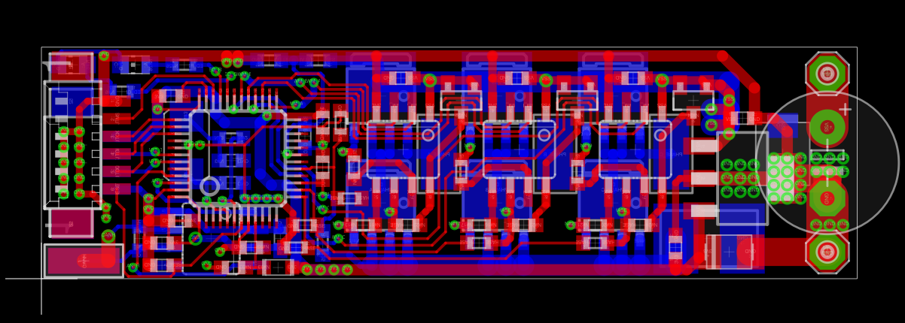

# STM32 Brushless Controller

## Description

This is a demo project which shows a Brushless Controller based on a STM32.

## Preview

## License

Creative Commons (CC0-1.0). For the license text, see [LICENSE.txt](LICENSE.txt).
